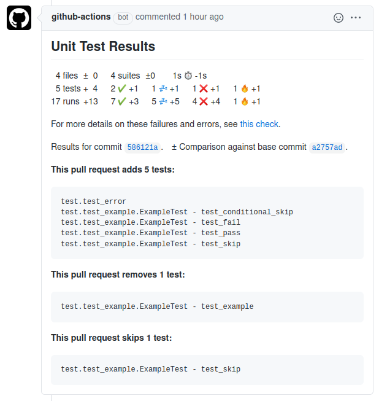

# GitHub Action to Publish Unit Test Results

[](https://github.com/EnricoMi/publish-unit-test-result-action/actions/workflows/ci-cd.yml)
[](https://github.com/EnricoMi/publish-unit-test-result-action/releases/latest)
[](http://www.apache.org/licenses/LICENSE-2.0)
[](https://github.com/search?q=publish-unit-test-result-action+path%3A.github%2Fworkflows%2F+language%3AYAML+language%3AYAML&type=Code&l=YAML)
[](https://github.com/users/EnricoMi/packages/container/package/publish-unit-test-result-action)

This [GitHub Action](https://github.com/actions) analyses Unit Test result files and
publishes the results on GitHub. It supports the JUnit XML file format.

You can add this action to your GitHub workflow as follows:

```yaml
- name: Publish Unit Test Results
  uses: EnricoMi/publish-unit-test-result-action@v1
  if: always()
  with:
    files: test-results/**/*.xml
```

The `if: always()` clause guarantees that this action always runs, even if earlier steps (e.g., the unit test step) in your workflow fail.

Unit test results are published in the GitHub Actions section of the respective commit:


***Note:** This action does not fail if unit tests failed. The action that executed the unit tests should
fail on test failure. The published results however indicate failure if tests fail or errors occur.
This behaviour is configurable.*

Each failing test will produce an annotation with failure details:


***Note:** Only the first failure of a test is shown. If you want to see all failures, set `report_individual_runs: "true"`.*

A comment is posted on the pull request of that commit, if one exists.
In presence of failures or errors, the comment links to the respective check page with failure details:


The checks section of the pull request also lists a short summary (here `1 fail, 1 skipped, 17 pass in 12s`),
and a link to the GitHub Actions section (here `Details`):


The result distinguishes between tests and runs. In some situations, tests run multiple times,
e.g. in different environments. Displaying the number of runs allows spotting unexpected
changes in the number of runs as well.

The change statistics (e.g. 5 tests ±0) might sometimes hide test removal.
Those are highlighted in pull request comments to easily spot unintended test removal:



***Note:** This requires `check_run_annotations` to be set to `all tests, skipped tests`.*

The symbols have the following meaning:

|Symbol|Meaning|
|:----:|-------|
||A successful test or run|
||A skipped test or run|
||A failed test or run|
||An erroneous test or run|
||The duration of all tests or runs|

## Configuration

The action can be configured by the following options. They are all optional except for `files`.

|Option|Default Value|Description|
|:-----|:-----:|:----------|
|`files`| |A file pattern to select the test result XML files, e.g. `test-results/**/*.xml`|
|`github_token`|`${{github.token}}`|An alternative GitHub token, other than the default provided by GitHub Actions runner.|
|`commit`|`${{env.GITHUB_SHA}}`|An alternative commit SHA to which test results are published. The `push` and `pull_request`events are handled, but for other [workflow events](https://docs.github.com/en/free-pro-team@latest/actions/reference/events-that-trigger-workflows#push) `GITHUB_SHA` may refer to different kinds of commits. See [GitHub Workflow documentation](https://docs.github.com/en/free-pro-team@latest/actions/reference/events-that-trigger-workflows) for details.|
|`check_name`|`"Unit Test Results"`|An alternative name for the check result.|
|`comment_title`|same as `check_name`|An alternative name for the pull request comment.|
|`fail_on`|`"test failures"`|Configures the state of the created test result check run. With `"test failures"` it fails if any test fails or test errors occur. It never fails when set to `"nothing"`, and fails only on errors when set to `"errors"`.|
|`hide_comments`|`"all but latest"`|Configures which earlier comments in a pull request are hidden by the action:<br/>`"orphaned commits"` - comments for removed commits<br/>`"all but latest"` - all comments but the latest<br/>`"off"` - no hiding|
|`comment_on_pr`|`true`|The action posts comments to a pull request that is associated with the commit if set to `true`.|
|`pull_request_build`|`"merge"`|GitHub builds a merge commit, which combines the commit and the target branch. If unit tests ran on the actual pushed commit, then set this to `"commit"`.|
|`test_changes_limit`|`10`|Limits the number of removed or skipped tests listed on pull request comments. This can be disabled with a value of `0`.|
|`report_individual_runs`|`false`|Individual runs of the same test may see different failures. Reports all individual failures when set `true`, and the first failure only otherwise.|
|`deduplicate_classes_by_file_name`|`false`|De-duplicates classes with same name by their file name when set `true`, combines test results for those classes otherwise.|
|`check_run_annotations`|`all tests, skipped tests`|Adds additional information to the check run (comma-separated list):<br>`all tests` - list all found tests,<br>`skipped tests` - list all skipped tests,<br>`none` - no extra annotations at all|
|`check_run_annotations_branch`|default branch|Adds check run annotations only on given branches. If not given, this defaults to the default branch of your repository, e.g. `main` or `master`. Comma separated list of branch names allowed, asterisk `"*"` matches all branches. Example: `main, master, branch_one`|

Files can be selected via the `files` variable, which is optional and defaults to the current working directory.
It supports wildcards like `*`, `**`, `?` and `[]`. The `**` wildcard matches
[directories recursively](https://docs.python.org/3/library/pathlib.html#pathlib.Path.glob): `./`, `./*/`, `./*/*/`, etc.

Pull request comments highlight removal of tests or tests that the pull request moves into skip state.
Those removed or skipped tests are added as a list, which is limited in length by `test_changes_limit`,
which defaults to `10`. Listing these tests can be disabled entirely by setting this limit to `0`.
This feature requires `check_run_annotations` to contain `all tests` in order to detect test addition
and removal, and `skipped tests` to detect new skipped and un-skipped tests, as well as
`check_run_annotations_branch` to contain your default branch.

## Use with matrix strategy

In a scenario where your unit tests run multiple times in different environments (e.g. a [strategy matrix](https://docs.github.com/en/actions/reference/workflow-syntax-for-github-actions#jobsjob_idstrategymatrix)),
the action should run only once over all test results. For this, put the action into a separate job
that depends on all your test environments. Those need to upload the test results as artifacts, which
are then all downloaded by your publish job.

```yaml
name: CI

on: [push]

jobs:
  build-and-test:
    name: Build and Test (Python ${{ matrix.python-version }})
    runs-on: ubuntu-latest

    strategy:
      fail-fast: false
      matrix:
        python-version: [3.6, 3.7, 3.8]

    steps:
      - name: Checkout
        uses: actions/checkout@v2

      - name: Setup Python ${{ matrix.python-version }}
        uses: actions/setup-python@v2
        with:
          python-version: ${{ matrix.python-version }}

      - name: PyTest
        run: python -m pytest test --junit-xml pytest.xml

      - name: Upload Unit Test Results
        if: always()
        uses: actions/upload-artifact@v2
        with:
          name: Unit Test Results (Python ${{ matrix.python-version }})
          path: pytest.xml

  publish-test-results:
    name: "Publish Unit Tests Results"
    needs: build-and-test
    runs-on: ubuntu-latest
    # the build-and-test job might be skipped, we don't need to run this job then
    if: success() || failure()

    steps:
      - name: Download Artifacts
        uses: actions/download-artifact@v2
        with:
          path: artifacts

      - name: Publish Unit Test Results
        uses: EnricoMi/publish-unit-test-result-action@v1
        with:
          files: artifacts/**/*.xml
```

## Support fork repositories and dependabot branches

Getting unit test results of pull requests created by [Dependabot](https://docs.github.com/en/github/administering-a-repository/keeping-your-dependencies-updated-automatically)
or by contributors from fork repositories requires some additional setup.

1. Condition the publish-unit-test-result action in your CI workflow to only publish test results
   when the action runs in your repository's context.
2. Your CI workflow has to upload unit test result files.
3. Set up an additional workflow on `workflow_run` events, which starts on completion of the CI workflow,
   downloads the unit test result files and runs this action on them.

Add this condition to your publish test results step in your CI workflow:

```yaml
if: >
  always() &&
  github.event.sender.login != 'dependabot[bot]' &&
  ( github.event_name != 'pull_request' || github.event.pull_request.head.repo.full_name == github.repository )
```

Add the following action step to your CI workflow to upload unit test results as artifacts.
Adjust the value of `path` to fit your setup:

```yaml
- name: Upload Test Results
  if: always()
  uses: actions/upload-artifact@v2
  with:
     name: Unit Test Results
     path: |
        test-results/*.xml
```

If you run tests in a [strategy matrix](https://docs.github.com/en/actions/reference/workflow-syntax-for-github-actions#jobsjob_idstrategymatrix),
make the artifact name unique for each job, e.g.: `name: Upload Test Results (${{ matrix.python-version }})`.

Add the following workflow that publishes unit test results. It downloads and extracts
all artifacts into `artifact/ARTIFACT_NAME/`, where `ARTIFACT_NAME` will be `Upload Test Results`
when setup as above, or `Upload Test Results (…)` when run in a strategy matrix.
It then runs the action on files in `artifacts/*/`.
Replace `*` with the name of your unit test artifacts if `*` does not work for you.
Also adjust the value of `workflows` (here `"CI"`) to fit your setup:


```yaml
name: Unit Test Results

on:
   workflow_run:
      workflows: ["CI"]
      types:
         - completed

jobs:
   unit-test-results:
      name: Unit Test Results
      runs-on: ubuntu-latest
      if: >
         github.event.workflow_run.conclusion != 'skipped' && (
            github.event.sender.login == 'dependabot[bot]' ||
            github.event.workflow_run.head_repository.full_name != github.repository
         )

      steps:
         - name: Download Artifacts
           uses: actions/github-script@v3
           with:
              script: |
                 var fs = require('fs');
                 var path = require('path');
                 var artifacts_path = path.join('${{github.workspace}}', 'artifacts')
                 fs.mkdirSync(artifacts_path, { recursive: true })

                 var artifacts = await github.actions.listWorkflowRunArtifacts({
                    owner: context.repo.owner,
                    repo: context.repo.repo,
                    run_id: ${{ github.event.workflow_run.id }},
                 });

                 for (const artifact of artifacts.data.artifacts) {
                    var download = await github.actions.downloadArtifact({
                       owner: context.repo.owner,
                       repo: context.repo.repo,
                       artifact_id: artifact.id,
                       archive_format: 'zip',
                    });
                    var artifact_path = path.join(artifacts_path, `${artifact.name}.zip`)
                    fs.writeFileSync(artifact_path, Buffer.from(download.data));
                    console.log(`Downloaded ${artifact_path}`);
                 }
         - name: Extract Artifacts
           run: |
              for file in artifacts/*.zip
              do
                if [ -f "$file" ]
                then
                  dir="${file/%.zip/}"
                  mkdir -p "$dir"
                  unzip -d "$dir" "$file"
                fi
              done

         - name: Publish Unit Test Results
           uses: EnricoMi/publish-unit-test-result-action@v1
           with:
              commit: ${{ github.event.workflow_run.head_sha }}
              files: "artifacts/*/**/*.xml"
```

Note: Running this action on `pull_request_target` events is [dangerous if combined with code checkout and code execution](https://securitylab.github.com/research/github-actions-preventing-pwn-requests).
