# GitHub Action to Publish Test Results

[](https://github.com/EnricoMi/publish-unit-test-result-action/actions/workflows/ci-cd.yml)
[](https://github.com/EnricoMi/publish-unit-test-result-action/releases/latest)
[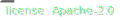](http://www.apache.org/licenses/LICENSE-2.0)
[](https://github.com/search?q=publish-unit-test-result-action+path%3A.github%2Fworkflows%2F+language%3AYAML+language%3AYAML&type=Code&l=YAML)
[](https://github.com/users/EnricoMi/packages/container/package/publish-unit-test-result-action)


[](https://gist.githubusercontent.com/EnricoMi/612cb538c14731f1a8fefe504f519395/raw/tests.svg)

This [GitHub Action](https://github.com/actions) analyses test result files and
publishes the results on GitHub. It supports [JSON (Dart, Mocha), TRX (MSTest, VS) and XML (JUnit, NUnit, XUnit) file formats](#generating-test-result-files),
and runs on Linux, macOS and Windows.

You can use this action with  runners (e.g. `runs-on: ubuntu-latest`)
or  self-hosted runners:

```yaml
- name: Publish Test Results
  uses: EnricoMi/publish-unit-test-result-action@v2
  if: always()
  with:
    files: |
      test-results/**/*.xml
      test-results/**/*.trx
      test-results/**/*.json
```

See the [notes on running this action with absolute paths](#running-with-absolute-paths) if you cannot use relative test result file paths.

Use this for  (e.g. `runs-on: macos-latest`)
and  (e.g. `runs-on: windows-latest`) runners:

```yaml
- name: Publish Test Results
  uses: EnricoMi/publish-unit-test-result-action/composite@v2
  if: always()
  with:
    files: |
      test-results/**/*.xml
      test-results/**/*.trx
      test-results/**/*.json
```

See the [notes on running this action as a composite action](#running-as-a-composite-action) if you run it on Windows or macOS.

If you see the `"Resource not accessible by integration"` error, you have to grant additional [permissions](#permissions), or
[setup the support for pull requests from fork repositories and branches created by Dependabot](#support-fork-repositories-and-dependabot-branches).

The `if: always()` clause guarantees that this action always runs, even if earlier steps (e.g., the test step) in your workflow fail.

When run multiple times in one workflow, the [option](#configuration) `check_name` has to be set to a unique value for each instance.
Otherwise, the multiple runs overwrite each other's results.

***Note:** By default, this action does not fail if tests failed. This can be [configured](#configuration) via `action_fail`.
The action that executed the tests should fail on test failure. The published results however indicate failure if tests fail or errors occur,
which can be [configured](#configuration) via `fail_on`.*

## Permissions

Minimal [workflow job permissions](https://docs.github.com/en/actions/using-jobs/assigning-permissions-to-jobs#example-setting-permissions-for-a-specific-job)
required by this action in **public** GitHub repositories are:

```yaml
permissions:
  checks: write
  pull-requests: write
```

The following permissions are required in **private** GitHub repos:

```yaml
permissions:
  contents: read
  issues: read
  checks: write
  pull-requests: write
```

With `comment_mode: off`, the `pull-requests: write` permission is not needed.

## Generating test result files

Supported test result files can be generated by many test environments. Here is a small overview, by far not complete.
Check your favorite development and test environment for its JSON, TRX file or JUnit, NUnit, XUnit XML file support.

|Test Environment |Language| JUnit<br/>XML | NUnit<br/>XML | XUnit<br/>XML | TRX<br/>file | JSON<br/>file |
|-----------------|:------:|:---------:|:---------:|:---------:|:---:|:---:|
|[Dart](https://github.com/dart-lang/test/blob/master/pkgs/test/doc/json_reporter.md)|Dart, Flutter| | | | |:white_check_mark:|
|[Jest](https://jestjs.io/docs/configuration#default-reporter)|JavaScript|:white_check_mark:| | | | |
|[Maven](https://maven.apache.org/surefire/maven-surefire-plugin/examples/junit.html)|Java, Scala, Kotlin|:white_check_mark:| | | | |
|[Mocha](https://mochajs.org/#xunit)|JavaScript|:white_check_mark:| |[not xunit](https://github.com/mochajs/mocha/issues/4758)| |:white_check_mark:|
|[MStest / dotnet](https://github.com/Microsoft/vstest-docs/blob/main/docs/report.md#syntax-of-default-loggers)|.Net|[:white_check_mark:](https://github.com/spekt/junit.testlogger#usage)|[:white_check_mark:](https://github.com/spekt/nunit.testlogger#usage)|[:white_check_mark:](https://github.com/spekt/xunit.testlogger#usage)|[:white_check_mark:](https://github.com/Microsoft/vstest-docs/blob/main/docs/report.md#syntax-of-default-loggers)| |
|[pytest](https://docs.pytest.org/en/latest/how-to/output.html#creating-junitxml-format-files)|Python|:white_check_mark:| | | | |
|[sbt](https://www.scala-sbt.org/release/docs/Testing.html#Test+Reports)|Scala|:white_check_mark:| | | | |
|Your favorite<br/>environment|Your favorite<br/>language|probably<br/>:white_check_mark:| | | | |

## What is new in version 2

<details>
<summary>These changes have to be considered when moving from version 1 to version 2:</summary>

### Default value for `check_name` changed
Unless `check_name` is set in your config, the check name used to publish test results changes from `"Unit Test Results"` to `"Test Results"`.

**Impact:**
The check with the old name will not be updated once moved to version 2.

**Workaround to get version 1 behaviour:**
Add `check_name: "Unit Test Results"` to your config.

### Default value for `comment_title` changed
Unless `comment_title` or `check_name` are set in your config, the title used to comment on open pull requests changes from `"Unit Test Results"` to `"Test Results"`.

**Impact:**
Existing comments with the old title will not be updated once moved to version 2, but a new comment is created.

**Workaround to get version 1 behaviour:**
See workaround for `check_name`.

### Modes `create new` and `update last` removed for option `comment_mode`
The action always updates an earlier pull request comment, which is the exact behaviour of mode `update last`.
The [configuration](#configuration) options `create new` and `update last` are therefore removed.

**Impact:**
An existing pull request comment is always updated.

**Workaround to get version 1 behaviour:**
Not supported.

### Option `hiding_comments` removed
The action always updates an earlier pull request comment, so hiding comments is not required anymore.

### Option `comment_on_pr` removed
Option `comment_on_pr` has been removed.

**Workaround to get version 1 behaviour:**
Set `comment_mode` to `always` (the default) or `off`.

</details>


## Publishing test results

Test results are published on GitHub at various ([configurable](#configuration)) places:

- as [a comment](#pull-request-comment) in related pull requests
- as [a check](#commit-and-pull-request-checks) in the checks section of a commit and related pull requests
- as [annotations](#commit-and-pull-request-annotations) in the checks section and changed files section of a commit and related pull requests
- as [a job summary](#github-actions-job-summary) of the GitHub Actions workflow
- as [a check summary](#github-actions-check-summary-of-a-commit) in the GitHub Actions section of the commit

### Pull request comment

A comment is posted on pull requests related to the commit.

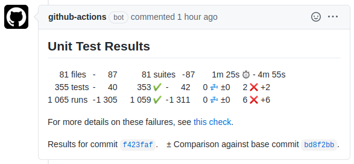

In presence of failures or errors, the comment links to the respective [check summary](#github-actions-check-summary-of-a-commit) with failure details.

Subsequent runs of the action will update this comment. You can access earlier results in the comment edit history:

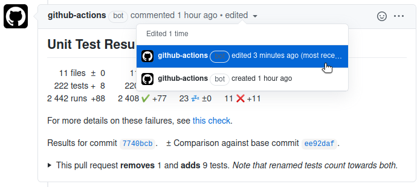

The result distinguishes between tests and runs. In some situations, tests run multiple times,
e.g. in different environments. Displaying the number of runs allows spotting unexpected
changes in the number of runs as well.

When tests run only a single time, no run information is displayed. Results are then shown differently then:

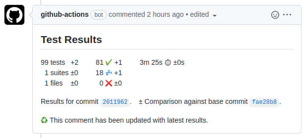

The change statistics (e.g. 5 tests ±0) might sometimes hide test removal.
Those are highlighted in pull request comments to easily spot unintended test removal:

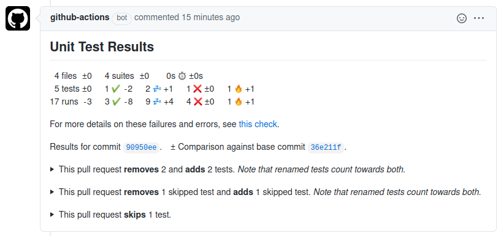

***Note:** This requires `check_run_annotations` to be set to `all tests, skipped tests`.*

Comments can be disabled with `comment_mode: off`.

### Commit and pull request checks

The checks section of a commit and related pull requests list a short summary (here `1 fail, 1 skipped, …`),
and a link to the [check summary](#github-actions-check-summary-of-a-commit) in the GitHub Actions section (here `Details`):

Commit checks:

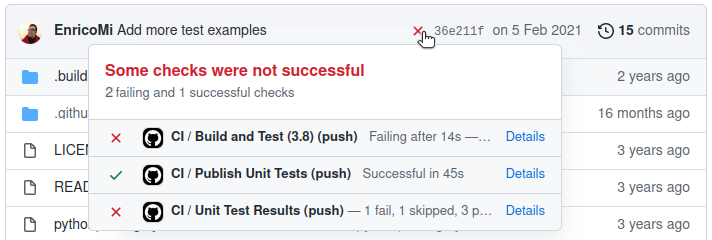

Pull request checks:

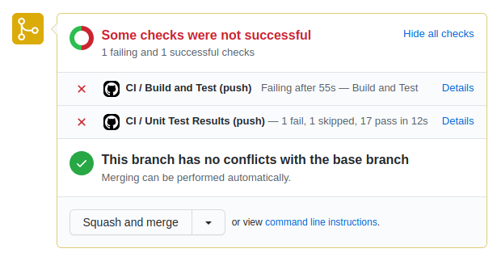

Check runs can be disabled with `check_run: false`.

### Commit and pull request annotations

Each failing test produces an annotation with failure details in the checks section of a commit:

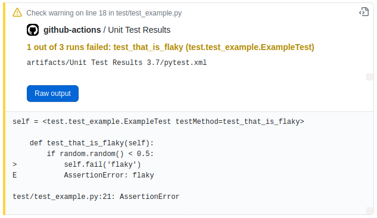

and the changed files section of related pull requests:

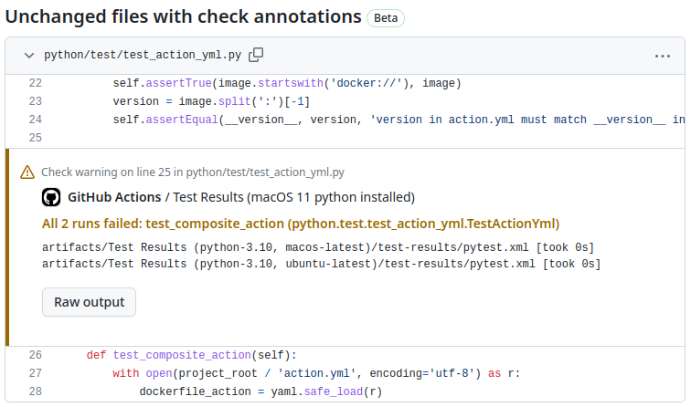

***Note:** Annotations for test files are only supported when test file paths in test result files are relative to the repository root.
Use option `test_file_prefix` to add a prefix to, or remove a prefix from these file paths. See [Configuration](#configuration) section for details.*

***Note:** Only the first failure of a test is shown. If you want to see all failures, set `report_individual_runs: "true"`.*

Check run annotations can be disabled with `ignore_runs: true`.

### GitHub Actions job summary

The results are added to the job summary page of the workflow that runs this action:

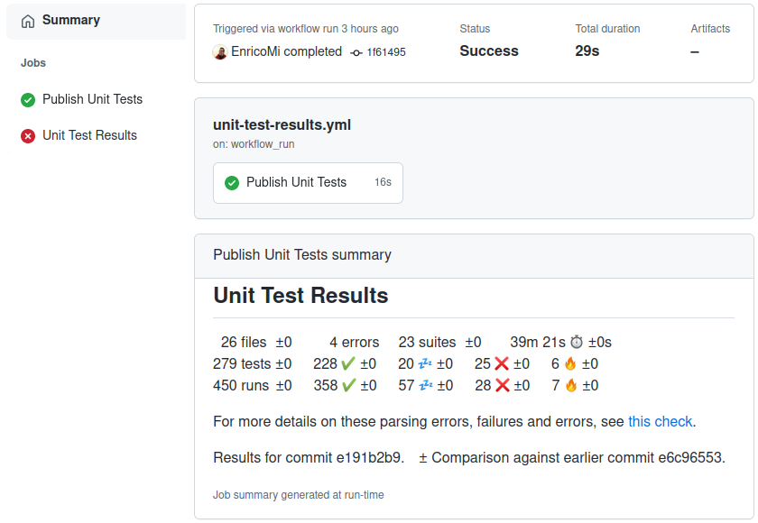

In presence of failures or errors, the job summary links to the respective [check summary](#github-actions-check-summary-of-a-commit) with failure details.

***Note:** Job summary requires [GitHub Actions runner v2.288.0](https://github.com/actions/runner/releases/tag/v2.288.0) or above.*

Job summaries can be disabled with `job_summary: false`.

### GitHub Actions check summary of a commit

Test results are published in the GitHub Actions check summary of the respective commit:

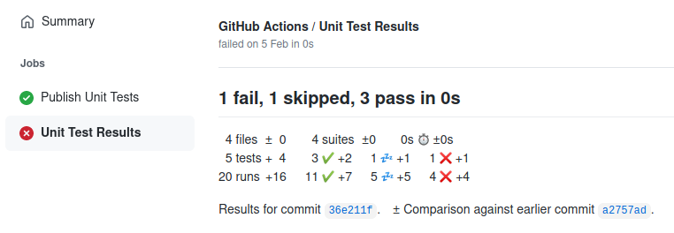

Check runs can be disabled with `check_run: false`.

## The symbols
[comment]: <> (This heading is linked to from method get_link_and_tooltip_label_md)

The symbols have the following meaning:

|Symbol|Meaning|
|:----:|-------|
|  :white_check_mark:|A successful test or run|
||A skipped test or run|
||A failed test or run|
||An erroneous test or run|
||The duration of all tests or runs|

***Note:*** For simplicity, "disabled" tests count towards "skipped" tests.

## Configuration

Files can be selected via the `files` option. It supports [glob wildcards](https://docs.python.org/3/library/glob.html#glob.glob)
like `*`, `**`, `?`, and `[]` character ranges. The `**` wildcard matches all files and directories recursively: `./`, `./*/`, `./*/*/`, etc.

You can provide multiple file patterns, one pattern per line. Patterns starting with `!` exclude the matching files.
There have to be at least one pattern starting without a `!`:

```yaml
with:
  files: |
    *.xml
    !config.xml
```

The list of most notable options:

|Option|Default Value|Description|
|:-----|:-----:|:----------|
|`files`|_no default_|File patterns of test result files. Relative paths are known to work best, while the composite action [also works with absolute paths](#running-with-absolute-paths). Supports `*`, `**`, `?`, and `[]` character ranges. Use multiline string for multiple patterns. Patterns starting with `!` exclude the matching files. There have to be at least one pattern starting without a `!`.|
|`check_name`|`"Test Results"`|An alternative name for the check result. Required to be unique for each instance in one workflow.|
|`comment_title`|same as `check_name`|An alternative name for the pull request comment.|
|`comment_mode`|`always`|The action posts comments to pull requests that are associated with the commit. Set to:<br/>`always` - always comment<br/>`changes` - comment when changes w.r.t. the target branch exist<br/>`changes in failures` - when changes in the number of failures and errors exist<br/>`changes in errors` - when changes in the number of (only) errors exist<br/>`failures` - when failures or errors exist<br/>`errors` - when (only) errors exist<br/>`off` - to not create pull request comments.|
|`large_files`|`false` unless<br/>`ignore_runs` is `true`|Support for large files is enabled when set to `true`. Defaults to `false`, unless ignore_runs is `true`.|
|`ignore_runs`|`false`|Does not collect test run information from the test result files, which is useful for very large files. This disables any check run annotations.|

<details>
<summary>Options related to Git and GitHub</summary>

|Option|Default Value|Description|
|:-----|:-----:|:----------|
|`commit`|`${{env.GITHUB_SHA}}`|An alternative commit SHA to which test results are published. The `push` and `pull_request`events are handled, but for other [workflow events](https://docs.github.com/en/free-pro-team@latest/actions/reference/events-that-trigger-workflows#push) `GITHUB_SHA` may refer to different kinds of commits. See [GitHub Workflow documentation](https://docs.github.com/en/free-pro-team@latest/actions/reference/events-that-trigger-workflows) for details.|
|`github_token`|`${{github.token}}`|An alternative GitHub token, other than the default provided by GitHub Actions runner.|
|`github_token_actor`|`github-actions`|The name of the GitHub app that owns the GitHub API Access Token (see github_token). Used to identify pull request comments created by this action during earlier runs. Has to be set when `github_token` is set to a GitHub app installation token (other than GitHub actions). Otherwise, existing comments will not be updated, but new comments created. Note: this does not change the bot name of the pull request comments.|
|`github_retries`|`10`|Requests to the GitHub API are retried this number of times. The value must be a positive integer or zero.|
|`seconds_between_github_reads`|`0.25`|Sets the number of seconds the action waits between concurrent read requests to the GitHub API.|
|`seconds_between_github_writes`|`2.0`|Sets the number of seconds the action waits between concurrent write requests to the GitHub API.|
|`secondary_rate_limit_wait_seconds`|`60.0`|Sets the number of seconds to wait before retrying secondary rate limit errors. If not set, the default defined in the PyGithub library is used (currently 60 seconds).|
|`pull_request_build`|`"merge"`|As part of pull requests, GitHub builds a merge commit, which combines the commit and the target branch. If tests ran on the actual pushed commit, then set this to `"commit"`.|
|`event_file`|`${{env.GITHUB_EVENT_PATH}}`|An alternative event file to use. Useful to replace a `workflow_run` event file with the actual source event file.|
|`event_name`|`${{env.GITHUB_EVENT_NAME}}`|An alternative event name to use. Useful to replace a `workflow_run` event name with the actual source event name: `${{ github.event.workflow_run.event }}`.|
|`search_pull_requests`|`false`|Prior to v2.6.0, the action used the `/search/issues` REST API to find pull requests related to a commit. If you need to restore that behaviour, set this to "true". Defaults to `false`.|
</details>

<details>
<summary>Options related to reporting test results</summary>

|Option|Default Value|Description|
|:-----|:-----:|:----------|
|`time_unit`|`seconds`|Time values in the test result files have this unit. Supports `seconds` and `milliseconds`.|
|`test_file_prefix`|`none`|Paths in the test result files should be relative to the git repository for annotations to work best. This prefix is added to (if starting with "+"), or remove from (if starting with "-") test file paths. Examples: "+src/" or "-/opt/actions-runner".|
|`check_run`|`true`|Set to `true`, the results are published as a check run, but it may not be associated with the workflow that ran this action.|
|`job_summary`|`true`|Set to `true`, the results are published as part of the [job summary page](https://github.blog/2022-05-09-supercharging-github-actions-with-job-summaries/) of the workflow run.|
|`compare_to_earlier_commit`|`true`|Test results are compared to results of earlier commits to show changes:<br/>`false` - disable comparison, `true` - compare across commits.'|
|`test_changes_limit`|`10`|Limits the number of removed or skipped tests reported on pull request comments. This report can be disabled with a value of `0`.|
|`report_individual_runs`|`false`|Individual runs of the same test may see different failures. Reports all individual failures when set `true`, and the first failure only otherwise.|
|`report_suite_logs`|`none`|In addition to reporting regular test logs, also report test suite logs. These are logs provided on suite level, not individual test level. Set to `info` for normal output, `error` for error output, `any` for both, or `none` for no suite logs at all. Defaults to `none`.|
|`deduplicate_classes_by_file_name`|`false`|De-duplicates classes with same name by their file name when set `true`, combines test results for those classes otherwise.|
|`check_run_annotations`|`all tests, skipped tests`|Adds additional information to the check run. This is a comma-separated list of any of the following values:<br>`all tests` - list all found tests,<br>`skipped tests` - list all skipped tests<br> Set to `none` to add no extra annotations at all.|
|`check_run_annotations_branch`|`event.repository.default_branch` or `"main, master"`|Adds check run annotations only on given branches. If not given, this defaults to the default branch of your repository, e.g. `main` or `master`. Comma separated list of branch names allowed, asterisk `"*"` matches all branches. Example: `main, master, branch_one`.|
|`json_file`|no file|Results are written to this JSON file.|
|`json_thousands_separator`|`" "`|Formatted numbers in JSON use this character to separate groups of thousands. Common values are "," or ".". Defaults to punctuation space (\u2008).|
|`json_suite_details`|`false`|Write out all suite details to the JSON file. Setting this to `true` can greatly increase the size of the output. Defaults to `false`.|
|`json_test_case_results`|`false`|Write out all individual test case results to the JSON file. Setting this to `true` can greatly increase the size of the output. Defaults to `false`.|
|`fail_on`|`"test failures"`|Configures the state of the created test result check run. With `"test failures"` it fails if any test fails or test errors occur. It never fails when set to `"nothing"`, and fails only on errors when set to `"errors"`.|
|`action_fail`|`false`|When set `true`, the action itself fails when tests have failed (see `fail_on`).|
|`action_fail_on_inconclusive`|`false`|When set `true`, the action itself fails when tests are inconclusive (no test results).|

Pull request comments highlight removal of tests or tests that the pull request moves into skip state.
Those removed or skipped tests are added as a list, which is limited in length by `test_changes_limit`,
which defaults to `10`. Reporting these tests can be disabled entirely by setting this limit to `0`.
This feature requires `check_run_annotations` to contain `all tests` in order to detect test addition
and removal, and `skipped tests` to detect new skipped and un-skipped tests, as well as
`check_run_annotations_branch` to contain your default branch.
</details>

## JSON result

The gathered test information are accessible as JSON via [GitHub Actions steps outputs](https://docs.github.com/en/actions/learn-github-actions/contexts#steps-context) string or JSON file.

<details>
<summary>Access JSON via step outputs</summary>

The `json` output of the action can be accessed through the expression `steps.<id>.outputs.json`.

```yaml
- name: Publish Test Results
  uses: EnricoMi/publish-unit-test-result-action@v2
  id: test-results
  if: always()
  with:
    files: "test-results/**/*.xml"

- name: Conclusion
  run: echo "Conclusion is ${{ fromJSON( steps.test-results.outputs.json ).conclusion }}"
```

Here is an example JSON:
```json
{
  "title": "4 parse errors, 4 errors, 23 fail, 18 skipped, 227 pass in 39m 12s",
  "summary": "  24 files  ±0      4 errors  21 suites  ±0   39m 12s [:stopwatch:](https://github.com/EnricoMi/publish-unit-test-result-action/blob/v2.6.1/README.md#the-symbols \"duration of all tests\") ±0s\n272 tests ±0  227 [:white_check_mark:](https://github.com/EnricoMi/publish-unit-test-result-action/blob/v2.6.1/README.md#the-symbols \"passed tests\") ±0  18 [:zzz:](https://github.com/EnricoMi/publish-unit-test-result-action/blob/v2.6.1/README.md#the-symbols \"skipped / disabled tests\") ±0  23 [:x:](https://github.com/EnricoMi/publish-unit-test-result-action/blob/v2.6.1/README.md#the-symbols \"failed tests\") ±0  4 [:fire:](https://github.com/EnricoMi/publish-unit-test-result-action/blob/v2.6.1/README.md#the-symbols \"test errors\") ±0 \n437 runs  ±0  354 [:white_check_mark:](https://github.com/EnricoMi/publish-unit-test-result-action/blob/v2.6.1/README.md#the-symbols \"passed tests\") ±0  53 [:zzz:](https://github.com/EnricoMi/publish-unit-test-result-action/blob/v2.6.1/README.md#the-symbols \"skipped / disabled tests\") ±0  25 [:x:](https://github.com/EnricoMi/publish-unit-test-result-action/blob/v2.6.1/README.md#the-symbols \"failed tests\") ±0  5 [:fire:](https://github.com/EnricoMi/publish-unit-test-result-action/blob/v2.6.1/README.md#the-symbols \"test errors\") ±0 \n\nResults for commit 11c02e56. ± Comparison against earlier commit d8ce4b6c.\n",
  "conclusion": "success",
  "stats": {
    "files": 24,
    "errors": 4,
    "suites": 21,
    "duration": 2352,
    "tests": 272,
    "tests_succ": 227,
    "tests_skip": 18,
    "tests_fail": 23,
    "tests_error": 4,
    "runs": 437,
    "runs_succ": 354,
    "runs_skip": 53,
    "runs_fail": 25,
    "runs_error": 5,
    "commit": "11c02e561e0eb51ee90f1c744c0ca7f306f1f5f9"
  },
  "stats_with_delta": {
    "files": {
      "number": 24,
      "delta": 0
    },
    …,
    "commit": "11c02e561e0eb51ee90f1c744c0ca7f306f1f5f9",
    "reference_type": "earlier",
    "reference_commit": "d8ce4b6c62ebfafe1890c55bf7ea30058ebf77f2"
  },
  "check_url": "https://github.com/EnricoMi/publish-unit-test-result-action/runs/5397876970",
  "formatted": {
     "stats": {
        "duration": "2 352",
        …
     },
     "stats_with_delta": {
        "duration": {
           "number": "2 352",
           "delta": "+12"
        },
        …
     }
  },
  "annotations": 31
}
```

The `formatted` key provides a copy of `stats` and `stats_with_delta`, where numbers are formatted to strings.
For example, `"duration": 2352` is formatted as `"duration": "2 352"`. The thousands separator can be configured
via `json_thousands_separator`. Formatted numbers are especially useful when those values are used where formatting
is not easily available, e.g. when [creating a badge from test results](#create-a-badge-from-test-results).

</details>

<details>
<summary>Access JSON via file</summary>

The optional `json_file` allows to [configure](#configuration) a file where extended JSON information are to be written.
Compared to `"Access JSON via step outputs"` above, `errors` and `annotations` contain more information
than just the number of errors and annotations, respectively.

Additionally, `json_test_case_results` can be enabled to add the `cases` field to the JSON file, which provides
all test results of all tests. Enabling this may greatly increase the output size of the JSON file.

```json
{
   …,
   "stats": {
      …,
      "errors": [
         {
            "file": "test-files/empty.xml",
            "message": "File is empty.",
            "line": null,
            "column": null
         }
      ],
      …
   },
   …,
   "annotations": [
      {
         "path": "test/test.py",
         "start_line": 819,
         "end_line": 819,
         "annotation_level": "warning",
         "message": "test-files/junit.fail.xml",
         "title": "1 out of 3 runs failed: test_events (test.Tests)",
         "raw_details": "self = <test.Tests testMethod=test_events>\n\n                def test_events(self):\n                > self.do_test_events(3)\n\n                test.py:821:\n                _ _ _ _ _ _ _ _ _ _ _ _ _ _ _ _ _ _ _ _ _ _ _ _ _ _ _ _ _ _ _ _ _ _ _ _ _ _ _ _\n                test.py:836: in do_test_events\n                self.do_test_rsh(command, 143, events=events)\n                test.py:852: in do_test_rsh\n                self.assertEqual(expected_result, res)\n                E AssertionError: 143 != 0\n            "
      }
   ],
   …,
   "cases": [
      {
         "class_name": "test.test_spark_keras.SparkKerasTests",
         "test_name": "test_batch_generator_fn",
         "states": {
            "success": [
               {
                  "result_file": "test-files/junit-xml/pytest/junit.spark.integration.1.xml",
                  "test_file": "test/test_spark_keras.py",
                  "line": 454,
                  "class_name": "test.test_spark_keras.SparkKerasTests",
                  "test_name": "test_batch_generator_fn",
                  "result": "success",
                  "time": 0.006
               },
               {
                  "result_file": "test-files/junit-xml/pytest/junit.spark.integration.2.xml",
                  "test_file": "test/test_spark_keras.py",
                  "line": 454,
                  "class_name": "test.test_spark_keras.SparkKerasTests",
                  "test_name": "test_batch_generator_fn",
                  "result": "success",
                  "time": 0.006
               }
            ]
         }
      },
   …
   ],
   …
}
```

</details>

See [Create a badge from test results](#create-a-badge-from-test-results) for an example on how to create a badge from this JSON.

## Use with matrix strategy

In a scenario where your tests run multiple times in different environments (e.g. a [strategy matrix](https://docs.github.com/en/actions/reference/workflow-syntax-for-github-actions#jobsjob_idstrategymatrix)),
the action should run only once over all test results. For this, put the action into a separate job
that depends on all your test environments. Those need to upload the test results as artifacts, which
are then all downloaded by your publish job.

<details>
<summary>Example workflow YAML</summary>

```yaml
name: CI

on: [push]
permissions: {}

jobs:
  build-and-test:
    name: Build and Test (Python ${{ matrix.python-version }})
    runs-on: ubuntu-latest

    strategy:
      fail-fast: false
      matrix:
        python-version: [3.6, 3.7, 3.8]

    steps:
      - name: Checkout
        uses: actions/checkout@v3

      - name: Setup Python ${{ matrix.python-version }}
        uses: actions/setup-python@v4
        with:
          python-version: ${{ matrix.python-version }}

      - name: PyTest
        run: python -m pytest test --junit-xml pytest.xml

      - name: Upload Test Results
        if: always()
        uses: actions/upload-artifact@v3
        with:
          name: Test Results (Python ${{ matrix.python-version }})
          path: pytest.xml

  publish-test-results:
    name: "Publish Tests Results"
    needs: build-and-test
    runs-on: ubuntu-latest
    permissions:
      checks: write

      # only needed unless run with comment_mode: off
      pull-requests: write

      # only needed for private repository
      contents: read

      # only needed for private repository
      issues: read
    if: always()

    steps:
      - name: Download Artifacts
        uses: actions/download-artifact@v3
        with:
          path: artifacts

      - name: Publish Test Results
        uses: EnricoMi/publish-unit-test-result-action@v2
        with:
          files: "artifacts/**/*.xml"
```
</details>

Please consider to [support fork repositories and dependabot branches](#support-fork-repositories-and-dependabot-branches)
together with your matrix strategy.

## Support fork repositories and dependabot branches
[comment]: <> (This heading is linked to from main method in publish_unit_test_results.py)

Getting test results of pull requests created by contributors from fork repositories or by
[Dependabot](https://docs.github.com/en/github/administering-a-repository/keeping-your-dependencies-updated-automatically)
requires some additional setup. Without this, the action will fail with the
`"Resource not accessible by integration"` error for those situations.

In this setup, your CI workflow does not need to publish test results anymore as they are **always** published from a separate workflow.

1. Your CI workflow has to upload the GitHub event file and test result files.
2. Set up an additional workflow on `workflow_run` events, which starts on completion of the CI workflow,
   downloads the event file and the test result files, and runs this action on them.
   This workflow publishes the test results for pull requests from fork repositories and dependabot,
   as well as all "ordinary" runs of your CI workflow.

<details>
<summary>Step-by-step instructions</summary>

1. Add the following job to your CI workflow to upload the event file as an artifact:

```yaml
event_file:
  name: "Event File"
  runs-on: ubuntu-latest
  steps:
  - name: Upload
    uses: actions/upload-artifact@v3
    with:
      name: Event File
      path: ${{ github.event_path }}
```

2. Add the following action step to your CI workflow to upload test results as artifacts.
Adjust the value of `path` to fit your setup:

```yaml
- name: Upload Test Results
  if: always()
  uses: actions/upload-artifact@v3
  with:
    name: Test Results
    path: |
      test-results/*.xml
```

3. If you run tests in a [strategy matrix](https://docs.github.com/en/actions/reference/workflow-syntax-for-github-actions#jobsjob_idstrategymatrix),
make the artifact name unique for each job, e.g.:
```yaml
  with:
    name: Test Results (${{ matrix.python-version }})
    path: …
```

4. Add the following workflow that publishes test results. It downloads and extracts
all artifacts into `artifacts/ARTIFACT_NAME/`, where `ARTIFACT_NAME` will be `Upload Test Results`
when setup as above, or `Upload Test Results (…)` when run in a strategy matrix.

   It then runs the action on files matching `artifacts/**/*.xml`.
Change the `files` pattern with the path to your test artifacts if it does not work for you.
The publish action uses the event file of the CI workflow.

   Also adjust the value of `workflows` (here `"CI"`) to fit your setup:

```yaml
name: Test Results

on:
  workflow_run:
    workflows: ["CI"]
    types:
      - completed
permissions: {}

jobs:
  test-results:
    name: Test Results
    runs-on: ubuntu-latest
    if: github.event.workflow_run.conclusion != 'skipped'

    permissions:
      checks: write

      # needed unless run with comment_mode: off
      pull-requests: write

      # only needed for private repository
      contents: read

      # only needed for private repository
      issues: read

      # required by download step to access artifacts API
      actions: read

    steps:
       - name: Download and Extract Artifacts
         uses: dawidd6/action-download-artifact@246dbf436b23d7c49e21a7ab8204ca9ecd1fe615
         with:
            run_id: ${{ github.event.workflow_run.id }}
            path: artifacts

      - name: Publish Test Results
        uses: EnricoMi/publish-unit-test-result-action@v2
        with:
          commit: ${{ github.event.workflow_run.head_sha }}
          event_file: artifacts/Event File/event.json
          event_name: ${{ github.event.workflow_run.event }}
          files: "artifacts/**/*.xml"
```

Note: Running this action on `pull_request_target` events is [dangerous if combined with code checkout and code execution](https://securitylab.github.com/research/github-actions-preventing-pwn-requests).
This event is therefore not use here intentionally!
</details>

## Running with multiple event types (pull_request, push, schedule, …)

This action comments on a pull request each time it is executed via any event type.
When run for more than one event type, runs will overwrite earlier pull request comments.

Note that `pull_request` events may produce different test results than any other event type.
The `pull_request` event runs the workflow on a merge commit, i.e. the commit merged into the target branch.
All other event types run on the commit itself.

If you want to distinguish between test results from `pull_request` and `push`, or want to distinguish the original test results
of the `push` to master from subsequent `schedule` events, you may want to add the following to your workflow.

<details>
<summary>There are two possible ways to avoid the publish action to overwrite results from other event types:</summary>

### Test results per event type

Add the event name to `check_name` to avoid different event types overwriting each other's results:

```yaml
- name: Publish Test Results
  uses: EnricoMi/publish-unit-test-result-action@v2
  if: always()
  with:
    check_name: "Test Results (${{ github.event.workflow_run.event || github.event_name }})"
    files: "test-results/**/*.xml"
```

### Pull request comments only for pull_request events

Disabling the pull request comment mode (`"off"`) for events other than `pull_request` avoids that any other event type overwrites pull request comments:

```yaml
- name: Publish Test Results
  uses: EnricoMi/publish-unit-test-result-action@v2
  if: always()
  with:
    # set comment_mode to "always" for pull_request event, set to "off" for all other event types
    comment_mode: ${{ (github.event.workflow_run.event == 'pull_request' || github.event_name == 'pull_request') && 'always' || 'off' }}
    files: "test-results/**/*.xml"
```
</details>

## Create a badge from test results

Here is an example how to use the [JSON](#json-result) output of this action to create a badge like this:
[](https://gist.githubusercontent.com/EnricoMi/612cb538c14731f1a8fefe504f519395/raw/badge.svg)

<details>
<summary>Example workflow YAML</summary>

```yaml
steps:
- …
- name: Publish Test Results
  uses: EnricoMi/publish-unit-test-result-action@v2
  id: test-results
  if: always()
  with:
    files: "test-results/**/*.xml"

- name: Set badge color
  shell: bash
  run: |
    case ${{ fromJSON( steps.test-results.outputs.json ).conclusion }} in
      success)
        echo "BADGE_COLOR=31c653" >> $GITHUB_ENV
        ;;
      failure)
        echo "BADGE_COLOR=800000" >> $GITHUB_ENV
        ;;
      neutral)
        echo "BADGE_COLOR=696969" >> $GITHUB_ENV
        ;;
    esac

- name: Create badge
  uses: emibcn/badge-action@d6f51ff11b5c3382b3b88689ae2d6db22d9737d1
  with:
    label: Tests
    status: '${{ fromJSON( steps.test-results.outputs.json ).formatted.stats.tests }} tests, ${{ fromJSON( steps.test-results.outputs.json ).formatted.stats.runs }} runs: ${{ fromJSON( steps.test-results.outputs.json ).conclusion }}'
    color: ${{ env.BADGE_COLOR }}
    path: badge.svg

- name: Upload badge to Gist
  # Upload only for master branch
  if: >
    github.event_name == 'workflow_run' && github.event.workflow_run.head_branch == 'master' ||
    github.event_name != 'workflow_run' && github.ref == 'refs/heads/master'
  uses: andymckay/append-gist-action@1fbfbbce708a39bd45846f0955ed5521f2099c6d
  with:
    token: ${{ secrets.GIST_TOKEN }}
    gistURL: https://gist.githubusercontent.com/{user}/{id}
    file: badge.svg
```

You have to create a personal access toke (PAT) with `gist` permission only. Add it to your GitHub Actions secrets, in above example with secret name `GIST_TOKEN`.

Set the `gistURL` to the Gist that you want to write the badge file to, in the form of `https://gist.githubusercontent.com/{user}/{id}`.

You can then use the badge via this URL: https://gist.githubusercontent.com/{user}/{id}/raw/badge.svg
</details>

## Running with absolute paths

It is known that this action works best with relative paths (e.g. `test-results/**/*.xml`),
but most absolute paths (e.g. `/tmp/test-results/**/*.xml`) require to use the composite variant
of this action (`uses: EnricoMi/publish-unit-test-result-action/composite@v2`).

If you have to use absolute paths with the non-composite variant of this action (`uses: EnricoMi/publish-unit-test-result-action@v2`),
you have to copy files to a relative path first, and then use the relative path:

```yaml
- name: Copy Test Results
  if: always()
  run: |
    cp -Lpr /tmp/test-results test-results
  shell: bash

- name: Publish Test Results
  uses: EnricoMi/publish-unit-test-result-action@v2
  if: always()
  with:
     files: |
        test-results/**/*.xml
        test-results/**/*.trx
        test-results/**/*.json
```

Using the non-composite variant of this action is recommended as it starts up much quicker.

## Running as a composite action

Running this action as a composite action allows to run it on various operating systems as it
does not require Docker. The composite action, however, requires a Python3 environment to be setup
on the action runner. All GitHub-hosted runners (Ubuntu, Windows Server and macOS) provide a suitable
Python3 environment out-of-the-box.

Self-hosted runners may require setting up a Python environment first:

```yaml
- name: Setup Python
  uses: actions/setup-python@v4
  with:
    python-version: 3.8
```

Self-hosted runners for Windows require Bash shell to be installed. Easiest way to have one is by installing
Git for Windows, which comes with Git BASH. Make sure that the location of `bash.exe` is part of the `PATH`
environment variable seen by the self-hosted runner.
