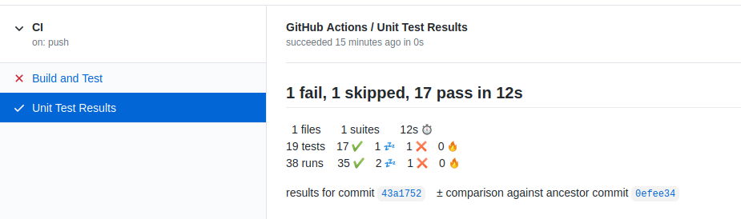
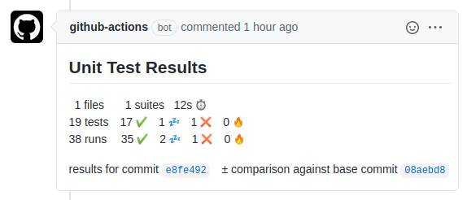
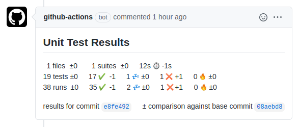

# GitHub Action to Publish Unit Test Results

This [GitHub Action](https://github.com/actions) analyses Unit Test result files and
publishes the results on GitHub. It supports the JUnit XML file format.

Unit test results are published in the GitHub Actions section of the respective commit:



***Note:** This action does not fail if unit tests failed. The action that executed the unit tests should
fail on test failure.*

Each failing test will produce an annotation with failure details:


***Note:** Only the first failure of a test is shown. If you want to see all failures, set `report_individual_runs: "true"`.*

A comment is posted on the pull request page of that commit, if one exists:



The checks section of the pull request also lists a short summary (here `1 fail, 1 skipped, 17 pass in 12s`),
and a link to the GitHub Actions section (here `Details`):


The result distinguishes between tests and runs. In some situations, tests run multiple times,
e.g. in different environments. Displaying the number of runs allows spotting unexpected
changes in the number of runs as well.

The symbols have the following meaning:

|Symbol|Meaning|
|:----:|-------|
||A successful test or run|
||A skipped test or run|
||A failed test or run|
||An erroneous test or run|
||The duration of all tests or runs|

When this action has been run on master, or earlier commits in the same branch, then this action
also compares unit test results across commits. This allows seeing changes in the number of tests and runs introduced by a given commit or pull request:



## Using this Action

You can add this action to your GitHub workflow on `push`, `pull_request`, and `pull_request_target` events
and configure it as follows:

```yaml
- name: Publish Unit Test Results
  uses: EnricoMi/publish-unit-test-result-action@v1.3
  if: always()
  with:
    github_token: ${{ secrets.GITHUB_TOKEN }}
    check_name: Unit Test Results
    comment_title: Unit Test Statistics
    hide_comments: all but latest
    comment_on_pr: true
    files: test-results/**/*.xml
    report_individual_runs: true
    deduplicate_classes_by_file_name: false
```

The `if: always()` clause guarantees that this action always runs, even if earlier steps (e.g., the unit test step) in your workflow fail.

The job name in the GitHub Actions section that provides the test results can be configured via the
`check_name` variable. It is optional and defaults to `"Unit Test Results"`, as shown in above screenshot.

Each run of the action creates a new comment on the respective pull request with unit test results.
The title of the comment can be configured via the `comment_title` variable.
It is optional and defaults to the `check_name` variable.

The `hide_comments` option allows hiding earlier comments to reduce the volume of comments.
The default is `all but latest`, which hides all earlier comments of the action.
Setting the option to `orphaned commits` will hide comments for orphaned commits only.
These are commits that do no longer belong to the pull request (due to commit history rewrite).
Hiding comments can be disabled all together with value `off`.

To disable comments on pull requests completely, set the option `comment_on_pr` to `false`.
Pull request comments are enabled by default.

Files can be selected via the `files` variable, which is optional and defaults to the current working directory.
It supports wildcards like `*`, `**`, `?` and `[]`. The `**` wildcard matches
[directories recursively](https://docs.python.org/3/library/pathlib.html#pathlib.Path.glob): `./`, `./*/`, `./*/*/`, etc.

If multiple runs exist for a test, only the first failure is reported, unless `report_individual_runs` is `true`.

In the rare situation where a project contains test class duplicates with the same name in different files,
you may want to set `deduplicate_classes_by_file_name` to `true`.

## Support fork repositories

This action posts a comment with test results to all pull requests that contain the commit and
are part of the repository that the action runs in. It would not be able to post to pull requests
in other repositories.

When someone forks your repository, the `push` event will run in the fork repository and cannot post
the results to a pull request in your repo. For that to work, you need to also trigger the workflow
on the `pull_request_target` event, which is [equivalent](https://docs.github.com/en/actions/reference/events-that-trigger-workflows#pull_request_target)
to the `pull_request` event, except it runs in the target repository of the pull request:

```yaml
on: [push, pull_request_target]
```

However, both events would trigger on pull request that merges within the same repository.
This can be avoided by the following job `if` clause:

```yaml
jobs:
  build-and-test:
    if: >
      github.event_name == 'push' ||
      github.event_name == 'pull_request_target' && github.event.pull_request.head.repo.full_name != github.repository
```

Now your action runs in forked repositories on `push`, and inside your repo
for pull requests from forks into your repository, which is able to publish to your pull request.

## Use with matrix strategy

In a scenario where your unit tests run multiple times in different environments (e.g. a matrix strategy),
the action should run only once over all test results. For this, put the action into a separate job
that depends on all your test environments. Those need to upload the test results as artifacts, which
are then all downloaded by your publish job.

You will need to use the `if: success() || failure()` clause when you [support fork repositories](#support-fork-repositories): 

```yaml
name: CI

on: [push, pull_request_target]

jobs:
  build-and-test:
    name: Build and Test (Python ${{ matrix.python-version }})
    runs-on: ubuntu-latest
    # always run on push events, but only run on pull_request_target event when pull request pulls from fork repository
    # for pull requests within the same repository, the pull event is sufficient
    if: >
      github.event_name == 'push' ||
      github.event_name == 'pull_request_target' && github.event.pull_request.head.repo.full_name != github.repository

    strategy:
      fail-fast: false
      matrix:
        python-version: [3.6, 3.7, 3.8]

    steps:
    - name: Checkout
      uses: actions/checkout@v2

    - name: Setup Python ${{ matrix.python-version }}
      uses: actions/setup-python@v2
      with:
        python-version: ${{ matrix.python-version }}

    - name: PyTest
      run: python -m pytest test --junit-xml pytest.xml

    - name: Upload Unit Test Results
      if: always()
      uses: actions/upload-artifact@v2
      with:
        name: Unit Test Results (Python ${{ matrix.python-version }})
        path: pytest.xml

  publish-test-results:
    name: "Publish Unit Tests Results"
    needs: build-and-test
    runs-on: ubuntu-latest
    # the build-and-test job might be skipped, we don't need to run this job then
    if: success() || failure()

    steps:
      - name: Download Artifacts
        uses: actions/download-artifact@v2
        with:
          path: artifacts

      - name: Publish Unit Test Results
        uses: EnricoMi/publish-unit-test-result-action@v1.3
        with:
          check_name: Unit Test Results
          github_token: ${{ secrets.GITHUB_TOKEN }}
          files: pytest.xml
```
