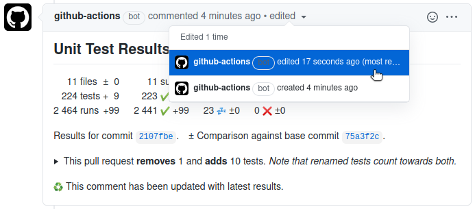

# GitHub Action to Publish Unit Test Results

[](https://github.com/EnricoMi/publish-unit-test-result-action/actions/workflows/ci-cd.yml)
[](https://github.com/EnricoMi/publish-unit-test-result-action/releases/latest)
[](http://www.apache.org/licenses/LICENSE-2.0)
[](https://github.com/search?q=publish-unit-test-result-action+path%3A.github%2Fworkflows%2F+language%3AYAML+language%3AYAML&type=Code&l=YAML)
[](https://github.com/users/EnricoMi/packages/container/package/publish-unit-test-result-action)


This [GitHub Action](https://github.com/actions) analyses Unit Test result files and
publishes the results on GitHub. It supports the JUnit XML file format and runs on Linux, macOS and Windows.

You can add this action to your GitHub workflow for Ubuntu runners (e.g. `runs-on: ubuntu-latest`) as follows:

```yaml
- name: Publish Unit Test Results
  uses: EnricoMi/publish-unit-test-result-action@v1
  if: always()
  with:
    files: test-results/**/*.xml
```

Use this for macOS (e.g. `runs-on: macos-latest`) and Windows (e.g. `runs-on: windows-latest`) runners:

```yaml
- name: Publish Unit Test Results
  uses: EnricoMi/publish-unit-test-result-action/composite@v1
  if: always()
  with:
    files: test-results/**/*.xml
```

See the [notes on running this action as a composite action](#running-as-a-composite-action) if you
run it on Windows or macOS.

The `if: always()` clause guarantees that this action always runs, even if earlier steps (e.g., the unit test step) in your workflow fail.

Unit test results are published in the GitHub Actions section of the respective commit:


***Note:** This action does not fail if unit tests failed. The action that executed the unit tests should
fail on test failure. The published results however indicate failure if tests fail or errors occur.
This behaviour is configurable.*

Each failing test will produce an annotation with failure details:


***Note:** Only the first failure of a test is shown. If you want to see all failures, set `report_individual_runs: "true"`.*

A comment is posted on the pull request of that commit.
In presence of failures or errors, the comment links to the respective check page with failure details:


Subsequent runs of the action will update this comment. You can access earlier results in the comment edit history:



The checks section of the pull request also lists a short summary (here `1 fail, 1 skipped, 17 pass in 12s`),
and a link to the GitHub Actions section (here `Details`):


The result distinguishes between tests and runs. In some situations, tests run multiple times,
e.g. in different environments. Displaying the number of runs allows spotting unexpected
changes in the number of runs as well.

The change statistics (e.g. 5 tests ±0) might sometimes hide test removal.
Those are highlighted in pull request comments to easily spot unintended test removal:


***Note:** This requires `check_run_annotations` to be set to `all tests, skipped tests`.*

## The symbols
[comment]: <> (This heading is linked to from method get_link_and_tooltip_label_md)

The symbols have the following meaning:

|Symbol|Meaning|
|:----:|-------|
||A successful test or run|
||A skipped test or run|
||A failed test or run|
||An erroneous test or run|
||The duration of all tests or runs|

***Note:*** For simplicity, "disabled" tests count towards "skipped" tests.

## Configuration

Files can be selected via the `files` option, which is optional and defaults to `*.xml` in the current working directory.
[It supports wildcards](https://docs.python.org/3/library/glob.html#glob.glob) like `*`, `**`, `?` and `[]`.
The `**` wildcard matches all files and directories recursively: `./`, `./*/`, `./*/*/`, etc.

You can provide multiple file patterns, one pattern per line. Patterns starting with `!` exclude the matching files.
There have to be at least one pattern starting without a `!`:

```yaml
with:
  files: |
    *.xml
    !config.xml
```

See the complete list of options below.

|Option|Default Value|Description|
|:-----|:-----:|:----------|
|`files`|`*.xml`|File patterns to select the test result XML files, e.g. `test-results/**/*.xml`. Use multiline string for multiple patterns. Supports `*`, `**`, `?`, `[]`. Excludes files when starting with `!`. |
|`check_name`|`"Unit Test Results"`|An alternative name for the check result.|
|`comment_title`|same as `check_name`|An alternative name for the pull request comment.|
|`comment_mode`|`update last`|The action posts comments to a pull request that is associated with the commit. Set to `create new` to create a new comment on each commit, `update last` to create only one comment and update later on, `off` to not create pull request comments.|
|`hide_comments`|`"all but latest"`|Configures which earlier comments in a pull request are hidden by the action:<br/>`"orphaned commits"` - comments for removed commits<br/>`"all but latest"` - all comments but the latest<br/>`"off"` - no hiding|
|`github_token`|`${{github.token}}`|An alternative GitHub token, other than the default provided by GitHub Actions runner.|
|`github_retries`|`10`|Requests to the GitHub API are retried this number of times. The value must be a positive integer or zero.|
|`seconds_between_github_reads`|`0.25`|Sets the number of seconds the action waits between concurrent read requests to the GitHub API.|
|`seconds_between_github_writes`|`2.0`|Sets the number of seconds the action waits between concurrent write requests to the GitHub API.|
|`commit`|`${{env.GITHUB_SHA}}`|An alternative commit SHA to which test results are published. The `push` and `pull_request`events are handled, but for other [workflow events](https://docs.github.com/en/free-pro-team@latest/actions/reference/events-that-trigger-workflows#push) `GITHUB_SHA` may refer to different kinds of commits. See [GitHub Workflow documentation](https://docs.github.com/en/free-pro-team@latest/actions/reference/events-that-trigger-workflows) for details.|
|`fail_on`|`"test failures"`|Configures the state of the created test result check run. With `"test failures"` it fails if any test fails or test errors occur. It never fails when set to `"nothing"`, and fails only on errors when set to `"errors"`.|
|`pull_request_build`|`"merge"`|GitHub builds a merge commit, which combines the commit and the target branch. If unit tests ran on the actual pushed commit, then set this to `"commit"`.|
|`event_file`|`${{env.GITHUB_EVENT_PATH}}`|An alternative event file to use. Useful to replace a `workflow_run` event file with the actual source event file.|
|`event_name`|`${{env.GITHUB_EVENT_NAME}}`|An alternative event name to use. Useful to replace a `workflow_run` event name with the actual source event name: `${{ github.event.workflow_run.event }}`.|
|`test_changes_limit`|`10`|Limits the number of removed or skipped tests listed on pull request comments. This can be disabled with a value of `0`.|
|`report_individual_runs`|`false`|Individual runs of the same test may see different failures. Reports all individual failures when set `true`, and the first failure only otherwise.|
|`deduplicate_classes_by_file_name`|`false`|De-duplicates classes with same name by their file name when set `true`, combines test results for those classes otherwise.|
|`compare_to_earlier_commit`|`true`|Test results are compared to results of earlier commits to show changes:<br/>`false` - disable comparison, `true` - compare across commits.'|
|`check_run_annotations`|`all tests, skipped tests`|Adds additional information to the check run (comma-separated list):<br>`all tests` - list all found tests,<br>`skipped tests` - list all skipped tests,<br>`none` - no extra annotations at all|
|`check_run_annotations_branch`|default branch|Adds check run annotations only on given branches. If not given, this defaults to the default branch of your repository, e.g. `main` or `master`. Comma separated list of branch names allowed, asterisk `"*"` matches all branches. Example: `main, master, branch_one`|

Pull request comments highlight removal of tests or tests that the pull request moves into skip state.
Those removed or skipped tests are added as a list, which is limited in length by `test_changes_limit`,
which defaults to `10`. Listing these tests can be disabled entirely by setting this limit to `0`.
This feature requires `check_run_annotations` to contain `all tests` in order to detect test addition
and removal, and `skipped tests` to detect new skipped and un-skipped tests, as well as
`check_run_annotations_branch` to contain your default branch.

## Use with matrix strategy

In a scenario where your unit tests run multiple times in different environments (e.g. a [strategy matrix](https://docs.github.com/en/actions/reference/workflow-syntax-for-github-actions#jobsjob_idstrategymatrix)),
the action should run only once over all test results. For this, put the action into a separate job
that depends on all your test environments. Those need to upload the test results as artifacts, which
are then all downloaded by your publish job.

```yaml
name: CI

on: [push]

jobs:
  build-and-test:
    name: Build and Test (Python ${{ matrix.python-version }})
    runs-on: ubuntu-latest

    strategy:
      fail-fast: false
      matrix:
        python-version: [3.6, 3.7, 3.8]

    steps:
      - name: Checkout
        uses: actions/checkout@v2

      - name: Setup Python ${{ matrix.python-version }}
        uses: actions/setup-python@v2
        with:
          python-version: ${{ matrix.python-version }}

      - name: PyTest
        run: python -m pytest test --junit-xml pytest.xml

      - name: Upload Unit Test Results
        if: always()
        uses: actions/upload-artifact@v2
        with:
          name: Unit Test Results (Python ${{ matrix.python-version }})
          path: pytest.xml

  publish-test-results:
    name: "Publish Unit Tests Results"
    needs: build-and-test
    runs-on: ubuntu-latest
    if: always()

    steps:
      - name: Download Artifacts
        uses: actions/download-artifact@v2
        with:
          path: artifacts

      - name: Publish Unit Test Results
        uses: EnricoMi/publish-unit-test-result-action@v1
        with:
          files: artifacts/**/*.xml
```

## Running as a composite action

Running this action as a composite action allows to run it on various operating systems as it
does not require Docker. The composite action, however, requires a Python3 environment to be setup
on the action runner. All GitHub-hosted runners (Ubuntu, Windows Server and macOS) provide a suitable
Python3 environment out-of-the-box.

Self-hosted runners may require setting up a Python environment first:

```yaml
- name: Setup Python
  uses: actions/setup-python@v2
  with:
    python-version: 3.8
```

### Isolating composite action from your workflow

Note that the composite action modifies this Python environment by installing dependency packages.
If this conflicts with actions that later run Python in the same workflow (which is a rare case),
it is recommended to run this action as the last step in your workflow, or to run it in an isolated workflow.
Running it in an isolated workflow is similar to the workflows shown in [Use with matrix strategy](#use-with-matrix-strategy).

To run the composite action in an isolated workflow, your CI workflow should upload all test result XML files:

```yaml
build-and-test:
  name: "Build and Test"
  runs-on: macos-latest

  steps:
  - …
  - name: Upload Unit Test Results
    if: always()
    uses: actions/upload-artifact@v2
    with:
      name: Unit Test Results
      path: test-results/**/*.xml
```

Your dedicated publish-unit-test-result-workflow then downloads these files and runs the action there:

```yaml
publish-test-results:
  name: "Publish Unit Tests Results"
  needs: build-and-test
  runs-on: windows-latest
  # the build-and-test job might be skipped, we don't need to run this job then
  if: success() || failure()

  steps:
    - name: Download Artifacts
      uses: actions/download-artifact@v2
      with:
        path: artifacts

    - name: Publish Unit Test Results
      uses: EnricoMi/publish-unit-test-result-action/composite@v1
      with:
        files: artifacts/**/*.xml
```

### Slow startup of composite action

In some environments, the composite action startup can be slow due to the installation of Python dependencies.
This is usually the case for **Windows** runners (in this example 35 seconds startup time):

```
Mon, 03 May 2021 11:57:00 GMT   ⏵ Run ./composite
Mon, 03 May 2021 11:57:00 GMT   ⏵ Check for Python3
Mon, 03 May 2021 11:57:00 GMT   ⏵ Install Python dependencies
Mon, 03 May 2021 11:57:35 GMT   ⏵ Publish Unit Test Results
```

This can be improved by caching the PIP cache directory. If you see the following warning in
the composite action output, then installing the `wheel` package can also be beneficial (see further down):

```
Using legacy 'setup.py install' for …, since package 'wheel' is not installed.
```

You can [cache files downloaded and built by PIP](https://github.com/actions/cache/blob/main/examples.md#python---pip)
using the `actions/cache` action, and conditionally install the `wheel`package as follows:

```yaml
- name: Cache PIP Packages
  uses: actions/cache@v2
  id: cache
  with:
    path: ~\AppData\Local\pip\Cache
    key: ${{ runner.os }}-pip-${{ hashFiles('**/requirements.txt, 'composite/action.yml') }}
    restore-keys: |
      ${{ runner.os }}-pip-

# only needed if you see this warning in action log output otherwise:
# Using legacy 'setup.py install' for …, since package 'wheel' is not installed.
- name: Install package wheel
  # only needed on cache miss
  if: steps.cache.outputs.cache-hit != 'true'
  run: python3 -m pip install wheel

- name: Publish Unit Test Results
  uses: EnricoMi/publish-unit-test-result-action/composite@v1
…
```

Use the correct `path:`, depending on your action runner's OS:
- macOS: `~/Library/Caches/pip`
- Windows: `~\AppData\Local\pip\Cache`
- Ubuntu: `~/.cache/pip`

With a cache populated by an earlier run, we can see startup time improvement (in this example down to 11 seconds):

```
Mon, 03 May 2021 16:00:00 GMT   ⏵ Run ./composite
Mon, 03 May 2021 16:00:00 GMT   ⏵ Check for Python3
Mon, 03 May 2021 16:00:00 GMT   ⏵ Install Python dependencies
Mon, 03 May 2021 16:00:11 GMT   ⏵ Publish Unit Test Results
```

## Support fork repositories and dependabot branches
[comment]: <> (This heading is linked to from main method in publish_unit_test_results.py)

Getting unit test results of pull requests created by [Dependabot](https://docs.github.com/en/github/administering-a-repository/keeping-your-dependencies-updated-automatically)
or by contributors from fork repositories requires some additional setup. Without this, the action will fail with the
`"Resource not accessible by integration"` error for those situations.

In this setup, your CI workflow does not need to publish unit test results anymore as they are **always** published from a separate workflow.

1. Your CI workflow has to upload the GitHub event file and unit test result files.
2. Set up an additional workflow on `workflow_run` events, which starts on completion of the CI workflow,
   downloads the event file and the unit test result files, and runs this action on them.
   This workflow publishes the unit test results for pull requests from fork repositories and dependabot,
   as well as all "ordinary" runs of your CI workflow.

Add the following job to your CI workflow to upload the event file as an artifact:

```yaml
event_file:
  name: "Event File"
  runs-on: ubuntu-latest
  steps:
  - name: Upload
    uses: actions/upload-artifact@v2
    with:
      name: Event File
      path: ${{ github.event_path }}
```

Add the following action step to your CI workflow to upload unit test results as artifacts.
Adjust the value of `path` to fit your setup:

```yaml
- name: Upload Test Results
  if: always()
  uses: actions/upload-artifact@v2
  with:
    name: Unit Test Results
    path: |
      test-results/*.xml
```

If you run tests in a [strategy matrix](https://docs.github.com/en/actions/reference/workflow-syntax-for-github-actions#jobsjob_idstrategymatrix),
make the artifact name unique for each job, e.g.: `name: Upload Test Results (${{ matrix.python-version }})`.

Add the following workflow that publishes unit test results. It downloads and extracts
all artifacts into `artifacts/ARTIFACT_NAME/`, where `ARTIFACT_NAME` will be `Upload Test Results`
when setup as above, or `Upload Test Results (…)` when run in a strategy matrix.
It then runs the action on files matching `artifacts/**/*.xml`.
Change the `files` pattern with the path to your unit test artifacts if it does not work for you.
The publish action uses the event file of the CI workflow.

Also adjust the value of `workflows` (here `"CI"`) to fit your setup:


```yaml
name: Unit Test Results

on:
  workflow_run:
    workflows: ["CI"]
    types:
      - completed

jobs:
  unit-test-results:
    name: Unit Test Results
    runs-on: ubuntu-latest
    if: github.event.workflow_run.conclusion != 'skipped'

    steps:
      - name: Download and Extract Artifacts
        env:
          GITHUB_TOKEN: ${{secrets.GITHUB_TOKEN}}
        run: |
           mkdir -p artifacts && cd artifacts

           artifacts_url=${{ github.event.workflow_run.artifacts_url }}

           gh api "$artifacts_url" -q '.artifacts[] | [.name, .archive_download_url] | @tsv' | while read artifact
           do
             IFS=$'\t' read name url <<< "$artifact"
             gh api $url > "$name.zip"
             unzip -d "$name" "$name.zip"
           done

      - name: Publish Unit Test Results
        uses: EnricoMi/publish-unit-test-result-action@v1
        with:
          commit: ${{ github.event.workflow_run.head_sha }}
          event_file: artifacts/Event File/event.json
          event_name: ${{ github.event.workflow_run.event }}
          files: "artifacts/**/*.xml"
```

Note: Running this action on `pull_request_target` events is [dangerous if combined with code checkout and code execution](https://securitylab.github.com/research/github-actions-preventing-pwn-requests).
