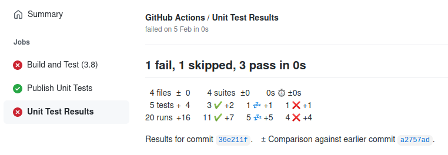
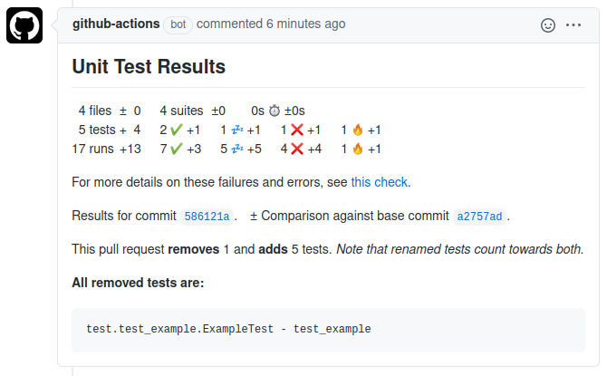

# GitHub Action to Publish Unit Test Results

This [GitHub Action](https://github.com/actions) analyses Unit Test result files and
publishes the results on GitHub. It supports the JUnit XML file format.

Unit test results are published in the GitHub Actions section of the respective commit:



***Note:** This action does not fail if unit tests failed. The action that executed the unit tests should
fail on test failure.*

Each failing test will produce an annotation with failure details:


***Note:** Only the first failure of a test is shown. If you want to see all failures, set `report_individual_runs: "true"`.*

A comment is posted on the pull request of that commit, if one exists.
In presence of failures or errors, the comment links to the respective check page with failure details:


The checks section of the pull request also lists a short summary (here `1 fail, 1 skipped, 17 pass in 12s`),
and a link to the GitHub Actions section (here `Details`):


The result distinguishes between tests and runs. In some situations, tests run multiple times,
e.g. in different environments. Displaying the number of runs allows spotting unexpected
changes in the number of runs as well.

The change statistics (e.g. 5 tests ±0) might sometimes hide test removal.
Those are highlighted in pull request comments to easily spot unintended test removal:



***Note:** This requires `check_run_annotations` to be set to `all tests, skipped tests`.*

The symbols have the following meaning:

|Symbol|Meaning|
|:----:|-------|
||A successful test or run|
||A skipped test or run|
||A failed test or run|
||An erroneous test or run|
||The duration of all tests or runs|

## Using this Action

You can add this action to your GitHub workflow as follows:

```yaml
- name: Publish Unit Test Results
  uses: EnricoMi/publish-unit-test-result-action@v1
  if: always()
  with:
    files: test-results/**/*.xml
```

The `if: always()` clause guarantees that this action always runs, even if earlier steps (e.g., the unit test step) in your workflow fail.

### Using pre-build Docker images

You can use a pre-built docker image from [GitHub Container Registry](https://docs.github.com/en/free-pro-team@latest/packages/getting-started-with-github-container-registry/about-github-container-registry) (Beta).
This way, the action is not build for every run of your workflow, and you are guaranteed to get the exact same action build:
```yaml
  uses: docker://ghcr.io/enricomi/publish-unit-test-result-action:v1
```

***Note:** GitHub Container Registry is currently in [beta phase](https://docs.github.com/en/free-pro-team@latest/packages/getting-started-with-github-container-registry/about-github-container-registry).*
This action may abandon GitHub Container Registry support when GitHub changes its conditions.

### Configuration

The action publishes results to the commit that it has been triggered on.
Depending on the [workflow event](https://docs.github.com/en/free-pro-team@latest/actions/reference/events-that-trigger-workflows#push)
this can be different kinds of commits.
See [GitHub Workflow documentation](https://docs.github.com/en/free-pro-team@latest/actions/reference/events-that-trigger-workflows)
for which commit the `GITHUB_SHA` environment variable actually refers to.

Pull request related events refer to the merge commit, which is not your pushed commit and is not part of the commit history shown
at GitHub. Therefore, the actual pushed commit SHA is used, provided by the [event payload](https://developer.github.com/webhooks/event-payloads/#pull_request).

If you need the action to use a different commit SHA than those described above,
you can set it via the `commit` option:

```yaml
with:
  commit: ${{ your-commit-sha }}
```

The job name in the GitHub Actions section that provides the test results can be configured via the
`check_name` option. It is optional and defaults to `"Unit Test Results"`, as shown in above screenshot.

Each run of the action creates a new comment on the respective pull request with unit test results.
The title of the comment can be configured via the `comment_title` variable.
It is optional and defaults to the `check_name` option.

The `hide_comments` option allows hiding earlier comments to reduce the volume of comments.
The default is `all but latest`, which hides all earlier comments of the action.
Setting the option to `orphaned commits` will hide comments for orphaned commits only.
These are commits that do no longer belong to the pull request (due to commit history rewrite).
Hiding comments can be disabled all together with value `off`.

To disable comments on pull requests completely, set the option `comment_on_pr` to `false`.
Pull request comments are enabled by default.

Files can be selected via the `files` variable, which is optional and defaults to the current working directory.
It supports wildcards like `*`, `**`, `?` and `[]`. The `**` wildcard matches
[directories recursively](https://docs.python.org/3/library/pathlib.html#pathlib.Path.glob): `./`, `./*/`, `./*/*/`, etc.

If multiple runs exist for a test, only the first failure is reported, unless `report_individual_runs` is `true`.

In the rare situation where a project contains test class duplicates with the same name in different files,
you may want to set `deduplicate_classes_by_file_name` to `true`.

With `check_run_annotations`, the check run provides additional information.
Use comma to set multiple values:

- All found tests are displayed with `all tests`.
- All skipped tests are listed with `skipped tests`.

These additional information are only added to the default branch of your repository, e.g. `main` or `master`.
Use `check_run_annotations_branch` to enable this for multiple branches (comma separated list) or all branches (`"*"`).

Pull request comments highlight removal of tests or tests that the pull request moves into skip state.
Those removed or skipped tests are added as a list, which is limited in length by `test_changes_limit`,
which defaults to `5`. Listing these tests can be disabled entirely by setting this limit to `0`.
This feature requires `check_run_annotations` to contain `all tests` in order to detect test addition
and removal, and `skipped tests` to detect new skipped and un-skipped tests, as well as
`check_run_annotations_branch` to contain your default branch.

Test results of a pull request from a fork cannot be published to your repository directly, so
a second action run has to pull the results into your repository. This action looks for the results
every `pull_from_fork_intervall_seconds` (default is 30).
It gives up after `pull_from_fork_timeout_minutes` (default is 30).

See this complete list of configuration options for reference:
```yaml
  with:
    github_token: ${{ secrets.PAT }}
    commit: ${{ your-commit-sha }}
    check_name: Unit Test Results
    comment_title: Unit Test Statistics
    hide_comments: all but latest
    comment_on_pr: true
    test_changes_limit: 5
    files: test-results/**/*.xml
    report_individual_runs: true
    deduplicate_classes_by_file_name: false
    check_run_annotations_branch: main, master, branch_one
    check_run_annotations: all tests, skipped tests
    pull_from_fork_timeout_minutes: 30
    pull_from_fork_intervall_seconds: 30
```

## On GitHub Events

You can run your GitHub workflows on different events. Some may make your CI workflow do a slightly
different thing.

Assume your GitHub workflow checks out your sources, builds and runs some tests. A classic unit test workflow.

Running this workflow on the following events has different implications:

|Event |What the workflow does|
|:-----|:---------------------|
|`push`|The workflow runs on the **latest commit** of a branch pushed to GitHub.|
|`pull_request`|The workflow runs on the **merge** of the latest commit of the branch and the target branch of the pull request. If an automatic merge has conflicts, then it runs on **latest commit** of a branch only.<br/>The action cannot create a check run or pull request comment on this event for a fork repository. See [Support fork repositories](#support-fork-repositories) on how to handle this situation.|
|`pull_request_target`|The workflow runs on the **latest commit of the target branch** of the pull request. It does not test the contribution branch that the pull request wants to merge into the target branch.|

## Support fork repositories

Fork repositories are only supported when above action in your CI workflow is set up
to run on a `push` event. Then, create a workflow **additional** to your CI workflow,
that runs the action on `pull_request_target`. It can then post the
unit test results from the `push` event run in the fork repository to the pull request in your repository.

Create this file at `.github/workflow/fork.yml`:

```yaml
name: Fork

on: [pull_request_target]

jobs:
  comment:
    name: Unit Test Results from Fork
    runs-on: ubuntu-latest
    # Only run if pull request is coming from a fork
    if: github.event.pull_request.head.repo.full_name != github.repository

    steps:
      - name: Post Pull Request Comment
        uses: EnricoMi/publish-unit-test-result-action@branch-pull-request-target
```

Note that this action has to be configured with the same value for `check_name` as used in your CI workflow.
If you are using the default value, then this option can be omitted.

Please [read and accept the risk](https://docs.github.com/en/actions/reference/events-that-trigger-workflows#pull_request_target)
running this action in your repo's context when using `pull_request_target`.

### Why are fork repositories so complicated?

This action posts a comment with test results to all pull requests that contain the commit and
are part of the repository that the action runs in. It would not be able to post to pull requests
in other repositories.

When someone forks your repository, any event (e.g. `push` or `pull_request`) will run in the fork repository
and cannot post the results to a pull request in your repo. For that to work, you need to run the
action on the `pull_request_target` event, which is [similar](https://docs.github.com/en/actions/reference/events-that-trigger-workflows#pull_request_target)
to the `pull_request` event, except that it runs in the target repository of the pull request.

The `pull_request_target` has some delicate implications. Firstly, it runs on the **latest commit
of the target branch**, not of your contribution branch. This means,
your workflow would compile and test the target branch, not the contribution of your pull request.
This is probably not what you want.

Secondly, your `pull_request_target` workflow should not execute code from a forked repository
for [security reasons](https://docs.github.com/en/actions/reference/events-that-trigger-workflows#pull_request_target),
as that code would have access to your secrets. To minimize risk, you should only run *this action*
on `pull_request_target` and keep it isolated from the workflow that generates unit test results.

## Use with matrix strategy

In a scenario where your unit tests run multiple times in different environments (e.g. a matrix strategy),
the action should run only once over all test results. For this, put the action into a separate job
that depends on all your test environments. Those need to upload the test results as artifacts, which
are then all downloaded by your publish job.

You will need to use the `if: success() || failure()` clause when you [support fork repositories](#support-fork-repositories): 

```yaml
name: CI

on: [push]

jobs:
  build-and-test:
    name: Build and Test (Python ${{ matrix.python-version }})
    runs-on: ubuntu-latest

    strategy:
      fail-fast: false
      matrix:
        python-version: [3.6, 3.7, 3.8]

    steps:
    - name: Checkout
      uses: actions/checkout@v2

    - name: Setup Python ${{ matrix.python-version }}
      uses: actions/setup-python@v2
      with:
        python-version: ${{ matrix.python-version }}

    - name: PyTest
      run: python -m pytest test --junit-xml pytest.xml

    - name: Upload Unit Test Results
      if: always()
      uses: actions/upload-artifact@v2
      with:
        name: Unit Test Results (Python ${{ matrix.python-version }})
        path: pytest.xml

  publish-test-results:
    name: "Publish Unit Tests Results"
    needs: build-and-test
    runs-on: ubuntu-latest
    # the build-and-test job might be skipped, we don't need to run this job then
    if: success() || failure()

    steps:
      - name: Download Artifacts
        uses: actions/download-artifact@v2
        with:
          path: artifacts

      - name: Publish Unit Test Results
        uses: EnricoMi/publish-unit-test-result-action@v1
        with:
          check_name: Unit Test Results
          files: pytest.xml
```
